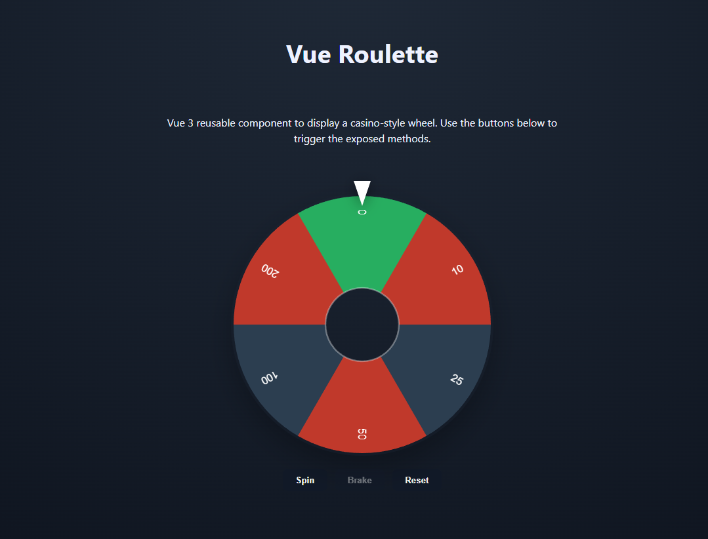

# Vue Roulette

Reusable Vue 3 component that renders an animated casino wheel on `<canvas>`. The package is meant to be a small publishable library (`npm install vue-roulette`) and ships with a local demo (`npm run dev`).

## Demo

A live demo is available at: [https://vue-roulette.ablondel.com/](https://vue-roulette.ablondel.com/)



## Installation

```bash
npm install vue-roulette
```

Then import the component (or the `RouletteItem` type) from the package.

## Quick start

```vue
<script setup lang="ts">
import { ref } from "vue";
import VueRoulette, { type RouletteItem } from "vue-roulette";

const items = ref<RouletteItem[]>([
  { label: "10", value: 10 },
  { label: "25", value: 25 },
  { label: "50", value: 50 },
]);

const selection = ref<RouletteItem | null>(null);
const rouletteRef = ref<InstanceType<typeof VueRoulette> | null>(null);

const onSelect = (item: RouletteItem) => {
  selection.value = item;
};

const spin = () => rouletteRef.value?.spin();
</script>

<template>
  <VueRoulette ref="rouletteRef" :items="items" :useColor="false" @select="onSelect" />
  <button @click="spin">Spin</button>
  <p v-if="selection">Winner: {{ selection.label }}</p>
</template>
```

## Props

| Prop              | Type                    | Default              | Description                                                          |
| ----------------- | ----------------------- | -------------------- | -------------------------------------------------------------------- |
| `items`           | `RouletteItem[]`        | required             | Segments to draw.                                                    |
| `size`            | `number`                | `400`                | Canvas width/height.                                                 |
| `spinDuration`    | `number`                | `4000`               | Total animation duration (ms).                                       |
| `easingFunction`  | `(t: number) => number` | `t => 1 - (1 - t)^4` | Acceleration/deceleration curve.                                     |
| `useColor`        | `boolean`               | `false`              | Uses each item's color when `true`.                                  |
| `initialVelocity` | `number`                | `2000`               | Degrees per second applied on launch to set the number of rotations. |
| `initialAngle`    | `number`                | `0`                  | Starting angle.                                                      |
| `enableTickSound` | `boolean`               | `false`              | Plays a click sound on every segment crossing.                       |
| `pointerOptions`  | `PointerOptions`        | `{}`                 | Customization options for the pointer (see below).                   |
| `pointerPosition` | `string`                | `'top'`              | Position of the pointer: `'top'`, `'right'`, `'bottom'`, or `'left'`.|
| `centerHoleRatio` | `number`                | `0.28`               | Size ratio of the center hole relative to the wheel radius (0-1).    |
| `spinOnClick`     | `boolean`               | `false`              | Enables spinning the wheel by clicking on it.                        |
| `tickSoundVolume` | `number`                | `0.15`               | Volume of the tick sound (0-1). Only applies when `enableTickSound` is `true`. |

### `RouletteItem` interface

```ts
interface RouletteItem {
  label: string;
  value: unknown;
  color?: string;
}
```

### `PointerOptions` interface

```ts
interface PointerOptions {
  visible?: boolean; // Show or hide the pointer (default: true)
  color?: string;    // Pointer color (default: '#ffffff')
  width?: number;    // Pointer width in pixels (default: 26)
  length?: number;   // Pointer length in pixels (default: 38)
}
```

## Emitted events

| Event          | Payload        | When                                         |
| -------------- | -------------- | -------------------------------------------- |
| `spin-start`   | `void`         | A spin begins.                               |
| `spin-end`     | `void`         | Animation ends (wheel stops).                |
| `select`       | `RouletteItem` | Item located at the pointer after stopping.  |
| `update:angle` | `number`       | Current angle (0-360) emitted on each frame. |

## Exposed methods

Reference the component via `ref`, then use `defineExpose`:

- `spin(): void` — starts a spin toward a randomly chosen item.
- `stop(): void` — requests a smooth stop toward the currently targeted item.
- `reset(): void` — cancels the animation and resets the angle to `initialAngle`.
- `getCurrentItem(): RouletteItem | null` — returns the item under the pointer.

## Color logic

- `useColor = true`: every item uses `item.color` (a built-in palette is used as a fallback when missing).
- `useColor = false`: automatic red/black alternation. If the item count is odd, a green "0" slice is inserted at position 0 before applying the alternation.

**Text color:** The label text color is automatically adjusted based on the background color luminance. Dark backgrounds display white text, while light backgrounds display black text for optimal readability.

## Local demo

```bash
npm install
npm run dev
```

The root page loads `Example.vue`, which showcases props, events, and exposed methods (`spin`, `stop`, `reset`).

## Build & publish

```bash
npm run build:lib
```

- `dist/vue-roulette.js`: ES module.
- `dist/vue-roulette.umd.cjs`: UMD build.
- `dist/index.d.ts`: TypeScript declarations.

Then publish to npm (after logging in):

```bash
npm publish --access public
```
